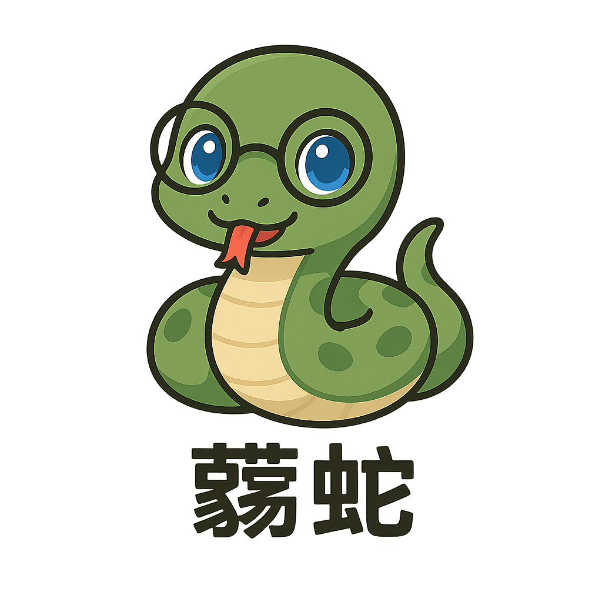

🐍 This repository is my personal space for learning and exploring Python.  
Here I collect everything I write in Python — homeworks, experiments, scripts, small tools, and broken things that teach me something useful.

🎯 What I'm Trying to Achieve

1. Learn Python on a deeper level — from basic syntax to structuring small tools and projects  
2. Track my learning progress and fix mistakes along the way  
3. Build my own toolkit of useful scripts, code snippets, and ideas  
4. Get comfortable enough to use Python daily

